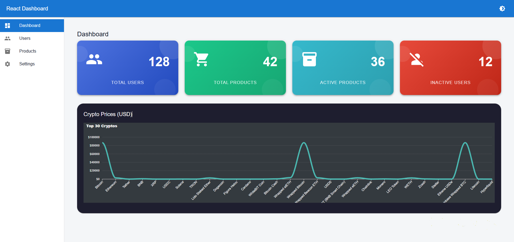

# React Admin Dashboard


A lightweight **admin dashboard** built with **React**, **TypeScript**, and **MUI v7**.  
Focused on clean UI, modern layout patterns, and REST API–based charts — **no backend required**.

---

## Screenshot



---

## Features

- Stat cards with large icons and gradient backgrounds
- REST API chart using ApexCharts (no API key)
- Material UI v7 (Grid v2, SX styling)
- Responsive and clean layout

---

## Tech Stack

- React
- TypeScript
- Material UI v7
- ApexCharts

---

## Getting Started

```bash
npm install
npm run dev
```

---

## License

MIT

---

## Author

GitHub: https://github.com/happycoder4ever
